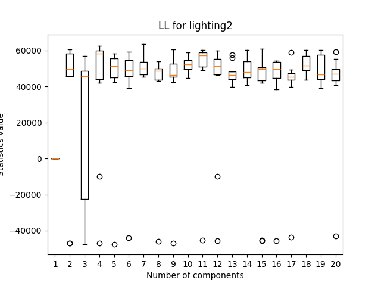
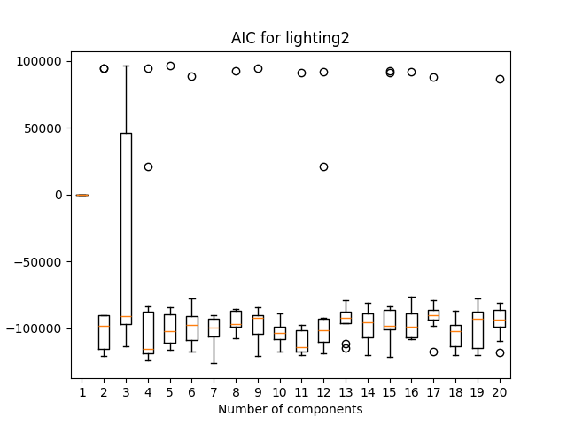
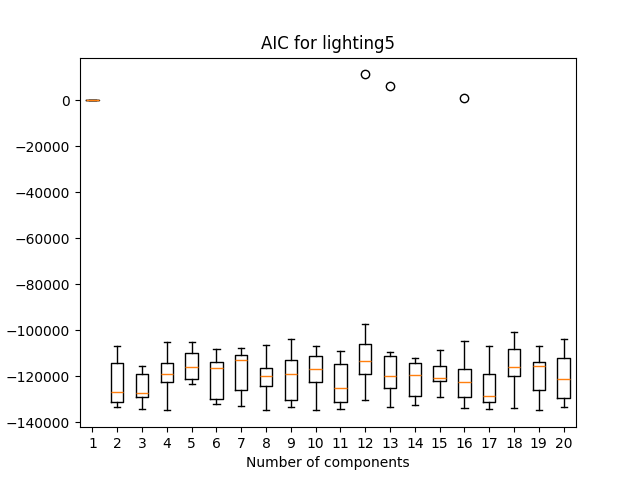
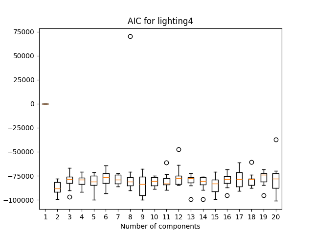
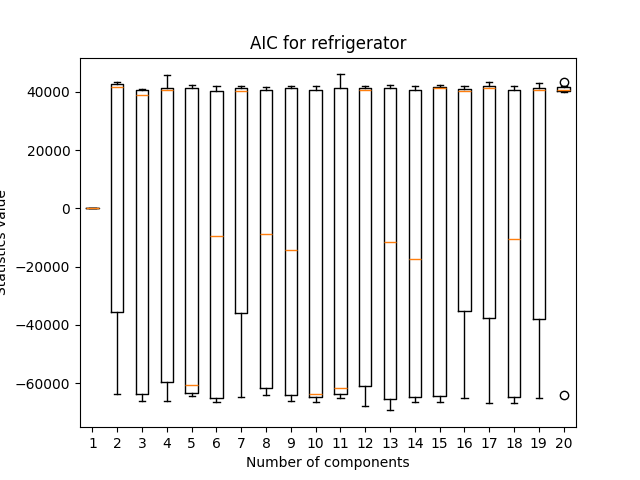
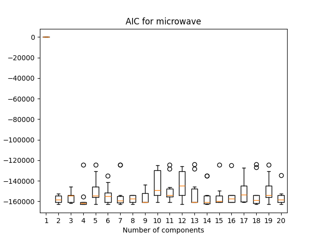

```{r setup, include=FALSE, message=FALSE, warning=FALSE}
knitr::opts_chunk$set(echo = TRUE, dev="cairo_pdf")
#load(file = "d.RData")
library("knitr")
library("gridExtra")
library("kableExtra")
```

# Wstęp
## Cel projektu
Celem projektu jest dokonanie klasyfikacji urządzeń elektrycznych użytku domowego opierając się na pomiarach poboru energii elektrycznej. Zakładając ukryty model Markowa chcemy wytrenować model, który później biorąc nowe dane o poborze energii będzie w stanie przewidzieć, któremu urządzeniu elektrycznemu one odpowiadają.

## Analiza zbioru danych
Zbiór treningowy stanowić będzie zbiór danych opisujący zużycie prądu mierzone w $20$-sekundowych odstępach przez $5$ wybranych urządzeń elektrycznych w pewnym gospodarstwie domowym w okresie od 16.04.2011, godz. 5:11:43 do 21.04.2011, godz. 7:21:44 (zob. Rys. 1). W pierwszej kolumnie *time* zawiera się informacja o czasie pomiaru, z kolei w $5$ kolejnych: *lighting2*, *lighting5*, *lighting4*, *refrigerator*, *microwave* - informacja o poborze prądu przez dane urządzenie. W procesie uczenia pierwszą kolumnę będziemy ignorować.\
Pliki ze zbiorami testowymi zawierają kolumnę *time* oraz *dev* oznaczającą pobór mocy przez pewne urządzenie. Plików jest $6$, zaś naszym zadaniem określenie, któremu z $5$ urządzeń owe odpowiadają.

## Ukryte łańcuchy Markowa (Hidden Markov Models, HMM)
Intuicyjnie łańcuch Markowa to taki proces, w którym stan układu (np. żarówka włączona lub żarówka wyłączona) zależy wyłącznie od stanu, w jakim był w poprzedniej chwili (i żadnej wcześniejszej). Możemy więc przykładowo zapytać, jakie prawdopodobieństwo, że żarówka będzie włączona w następnej chwili czasu, jeśli w obecnej też jest włączona. Tym samym każdy łańcuch Markowa opisuje przestrzeń stanów - w rozważanym przykładzie będzie to $\mathbf{E} = \lbrace \text{włączona}, \text{wyłączona} \rbrace$ - oraz macierz prawdopodobieństw przejść pomiędzy tymi stanami.\
W rzeczywistości jednak często nie możemy obserwować bezpośrednio stanu występującego w danej chwili czasu. Skrajnym przykładem może być tutaj świecenie się diody: jeśli dioda się świeci, to urządzenie (np. komputer) wykonuje jakąś pracę (zmienia stan), ale nie wiemy jaką. W tym przypadku stany z $\mathbf{E}$ pozostają dla nas ukryte, a dysponujeny jedynie obserwacjami diody, $\mathbf{O} = \lbrace \text{świeci}, \text{nie świeci} \rbrace$.\
Przenosząc ten problem na nasze zagadnienie: powiemy, że wykres poboru prądu $f$ danego urządzenia jest wynikiem ukrytego łańcucha Markowa. Naszym zadaniem jest znalezienie modelu $\square$ o takiej liczbie ukrytych stanów ($\rightarrow$ komponent), że obserwując pobór prądu $f$ model ten będzie najbardziej prawdopodobny. Krótko mówiąc, szukamy dla jakiej liczby ukrytych stanów (komponent), prawdopodobieństwo $P(\square|f)$ będzie największe.

```{r pl1, fig.show='hold', echo = FALSE, message=FALSE, warning=FALSE, fig.cap = "Pobór prądu (zbiór testowy) dla rozważanych 5 urządzeń elektrycznych gospodarstwa domowego.", out.width = '49%', fig.align = 'center'}
include_graphics("1.png")
include_graphics("2.png")
include_graphics("3.png")
include_graphics("4.png")
include_graphics("5.png")
include_graphics("pobory.png")
```

\newpage

## Kryteria wyboru modelu
Hiperparametrem HMM jest liczba ukrytych stanów. Zagadnienie maksymalizacji $P(\square|f)$ względem tego hiperparametru można przeprowadzić opierając się na:

- funkcji log-wiarogodności (LL) $\rightarrow$ szukamy wtedy maksimum owej funkcji;

- kryteriach AIC lub BIC przyznających karę za złożoność modelu (wielkość hiperparametru) $\rightarrow$ tutaj szukamy minimum.

Różnica między AIC i BIC jest taka, że to ostatnie przyznaje ponadto karę za liczbę obserwacji. Ponieważ liczby tej w żaden sposób nie zmieniamy, toteż na wykresach różnica między AIC i BIC będzie objawiać się względnym przesunięciem w pionie. Zauważymy też za chwilę, że wykresy AIC/BIC stanowią odbicie w pionie wykresu LL i zasadaniczo możemy ograniczyć nasze rozważania do jednego z tych kryteriów.\
Funkcją generującą HMM w Pythonie jest *hmm.GaussianHMM()* z pakietu *hmmlearn*. Nie wdając się w szczegóły techniczne, funkcja ta wymaga zadeklarowania jako parametru ziarna losowego, *random_state*. Wobec tego dla danej liczby ukrytych stanów będziemy tworzyć HMM dla $10$ różnych ziaren i na tej podstawie narysujemy boxplot. Tak będziemy postępować dla kolejnych liczb komponent.

# Wybór liczby komponent
## Wstępna selekcja
Na Rys. 2 możemy zauważyć to, co zostało wspomniane wyżej: nie ma zasadniczej różnicy, na podstawie którego kryterium dokonujemy selekcji. Dlatego ograniczymy się do kryterium AIC (Rys. 3). W pierwszej kolejności obserwujemy położenie mediany (pomarańczowa kreska), w drugiej - rozstęp międzykwartylowy. Wstępny wybór liczby ukrytych stanów jest następujący:

- *lighting2*: 4, 11;

- *lighting5*: 3, 17;

- *lighting4*: 2, 11;

- *refrigerator*: 5, 6, 10;

- *microwave*: 4, 5, 9.

Oczywiście pewną sugestią co do liczby ukrytych stanów jest też natura analizowanego urządzenia, zob. Rys. 1. Przede wszystkim mało prawdopodobne jest, by istiało 11 albo 17 poziomów oświetlenia (Rys. 1.1-3). To samo tyczy się lodówki, która w okolicznościach większego zapełnienia ma więcej rzeczy do schłodzenia, niemniej po osiągnieciu równowagi, tylko okresowo dochładza swoją zawartość (Rys. 1.4). Wreszcie mikrofalówka technicznie może działać na różnych poziomach mocy, jednak z doświadczenia najczęściej używa się domyślnego (Rys. 1.5). Dlatego intuicja każe nam raczej ograniczać niż mnożyć liczbę ukrytych stanów.

```{r pl2, fig.show='hold', echo = FALSE, message=FALSE, warning=FALSE, fig.cap = "Wyniki dopasowania HMM do *lighting2* dla kolejnych liczb ukrytych stanów.", out.width = '49%', fig.align = 'center'}



```

```{r pl3, fig.show='hold', echo = FALSE, message=FALSE, warning=FALSE, fig.cap = "Wyniki dopasowania HMM dla kolejnych liczb ukrytych stanów.", out.width = '49%', fig.align = 'center'}





```

## Walidacja krzyżowa 

Aby wybrać najbardziej optymalną ze wstępnych kombinacji ukrytych stanów użyliśmy metody walidacji krzyżowej. \

Kroswalidacja (**cross-validation**) to  statystyczna technika, stosowana w nauczaniu maszynowym, w celu optymalizacji doboru modelu i jego parametrów do analizowanych danych. Polega kilkakrotnym trenowaniu i ewaluacji modelu na różnych zbiorach uczących i testowych, aby końcowo wybrać parametry, dla których średni wynik był najlepszy. \
W projekcie użyliśmy techniki **K-fold cross-validation** z parametrem $K$ równym $5$. Oznacza to, że dane podzielone zostały na $5$ równych części, a model testowany był pięciokrotnie. Każda z części raz służyła jako zbiór testowy, podczas gdy pozostałe dane służyły jako zbiór treningowy. Dla każdej z kombinacji liczyliśmy wartość statystyki AIC, by na końcu wybrać parametry minimalizujące średni wynik. \
Kroswalidację powtórzyliśmy $10$ razy i na tej podstawie otrzymaliśmy następujące liczby ukrytych stanów:

- *lighting2*: 11;

- *lighting5*: 17;

- *lighting4*: 11;

- *refrigerator*: 10;

- *microwave*: 9.

Zastosowany przez nas podział danych przy kroswalidacji nie uwzględniał jednak relacji między nimi. W przypadku łańcuchów Markowa wybór danych testowych powinien zachowywać strukturalną zależność między obserwacjami. Ważna jest także kolejność obserwacji, jako że zmiany stanów definiowane są specyficzną macerzą przejść. Aby poprawić wiarygodność wyników modfikujemy używaną wcześniej funkcję kroswalidacji. Dzięki dodaniu funkcji *TimeSeriesSplit(n_splits=5)* dzielimy dane na $5$ sekwencji zachowywyjąch chronologię obserwacji. Otrzymane wyniki to:

- *lighting2*: 11;

- *lighting5*: 12;

- *lighting4*: 11;

- *refrigerator*: 10;

- *microwave*: 9.


W końcowym modelu przyjmiemy parametry otrzymane dzięki walidacji krzyżowej uwzględniającej segmenty. Ten sposób zapobiega nadmiernemu dopasowywaniu się do zbioru treninogwego i daje najlepsze efekty przy porównaniu wyników z poprawną klasyfikacją urządzeń z pliku *test_folder.tar.gz*.

# Klasyfikacja 

Główną częścią projektu jest stworzenie modelu dla każdego z urządzeń. Aby wytrenować model korzystamy z danych z pliku testowego oraz z wyżej dobranych parametrów.


